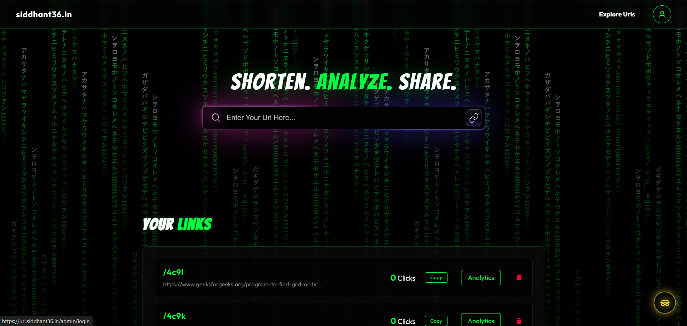
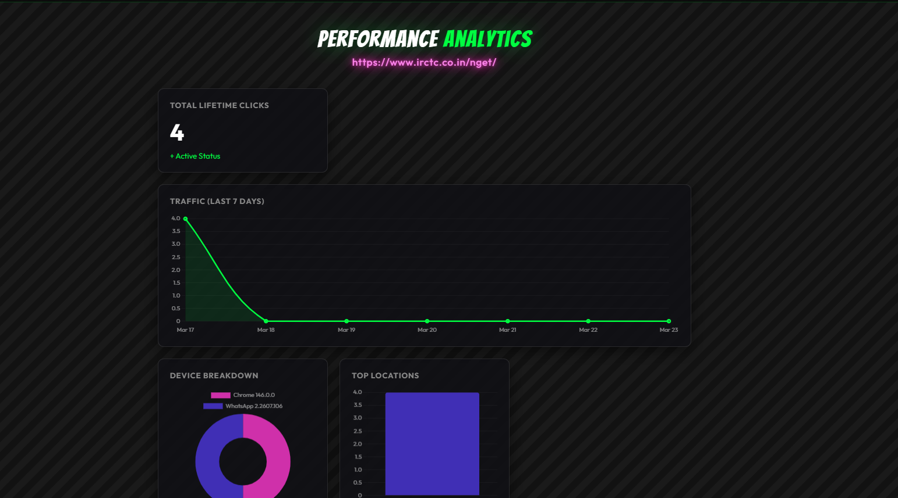
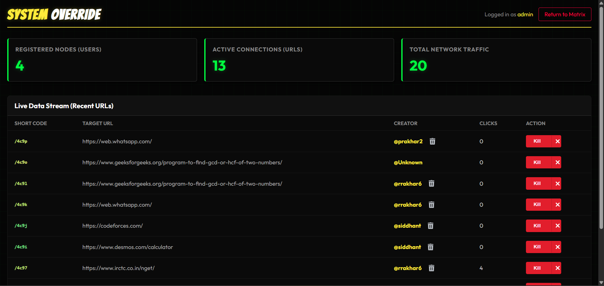

# 🔗 URL Shortener — Analytics & Admin Platform

A full-stack URL shortening platform built with Node.js, MongoDB, and Redis, featuring real-time analytics, admin controls, and performance optimizations using caching and rate limiting.

🌐 Live: https://url.siddhant36.in

---

## 🚀 Features

### 👤 User Side

- User authentication (session-based login/signup)
- Generate short URLs using Base62 encoding
- View all created URLs in dashboard
- Copy, delete, and manage links
- View detailed analytics for each URL
- Explore trending public URLs

### 📊 Analytics

- Total click tracking
- Last 7 days traffic visualization
- Device breakdown (browser/user-agent based)
- Country-level analytics
- Real-time tracking on each redirect

### 🛠️ Admin Panel

- Admin authentication with role-based access
- View total users, URLs, and network traffic
- Monitor recent URL activity
- Delete users and all associated links
- System-level moderation dashboard

### ⚡ Backend Optimizations

- Redis caching with:
- Cache-first redirect strategy
- Write-through caching for URLs
- Idempotency locks to prevent duplicate URL creation
- Rate limiting using Redis (custom middleware)
- MongoDB aggregation for analytics
- Soft delete system for users and URLs

---

## 🧱 Tech Stack

### Backend

- Node.js
- Express.js
- MongoDB (Mongoose)
- Redis

### Frontend

- EJS (Server-side rendering)
- Vanilla JavaScript
- CSS

### Other Tools

- Chart.js (analytics visualization)
- express-validator (input validation)
- bcrypt (password hashing)

---

## 📁 Project Structure

    url-shortener/
    ├── controllers/
    ├── models/
    ├── routes/
    ├── middleware/
    ├── configs/
    ├── public/
    ├── views/
    └── screenshots/

---

## 📄 Key Pages

### User

- Landing Page (URL shortening)
- Dashboard (user URLs)
- Analytics Page
- Explore Page (trending URLs)

### Admin

- Admin Login
- Admin Dashboard (system overview + moderation)

---

## ⚙️ Environment Variables

Create a `.env` file:

    PORT=3000
    MONGO_URI=your_mongodb_uri
    REDIS_URL=your_redis_url
    BASE_URL=https://url.siddhant36.in
    SESSION_SECRET=your_secret

---

## 🧪 Run Locally

    git clone <your-repo-link>
    cd url-shortener
    npm install
    npm run dev

---

## ⚡ Performance Highlights

- Implemented Redis caching to reduce redirect latency
- Used idempotency locks to prevent duplicate URL generation
- Designed cache-first architecture for high-read endpoints
- Optimized analytics processing using single-pass aggregation (O(n))

---

## 🌐 Deployment

Frontend + Backend: https://url.siddhant36.in

---

## 🔐 Security Note

- Admin credentials are not publicly exposed
- Role-based access control enforced on backend
- Rate limiting applied to sensitive endpoints (login, URL creation)

---

## 📌 Notes

- Uses Base62 encoding for compact short URLs
- Implements soft deletes instead of hard deletes for data safety
- Redis is used for both caching and rate limiting
- Designed keeping scalability and performance in mind

---

## 📷 Screenshots

### 🏠 User Dashboard

  

---

### 📊 Analytics Page

  

---

### 🛠️ Admin Dashboard

  

---

## 🧠 Challenges & Learnings

- Implemented Redis-based idempotency to handle duplicate requests safely
- Designed cache-first architecture for faster redirects
- Built custom rate limiter using Redis for API protection
- Optimized analytics computation using single-pass iteration
- Managed role-based access control for admin operations

---

## 📬 Contact

For queries or collaboration, feel free to connect or raise an issue in this repository.